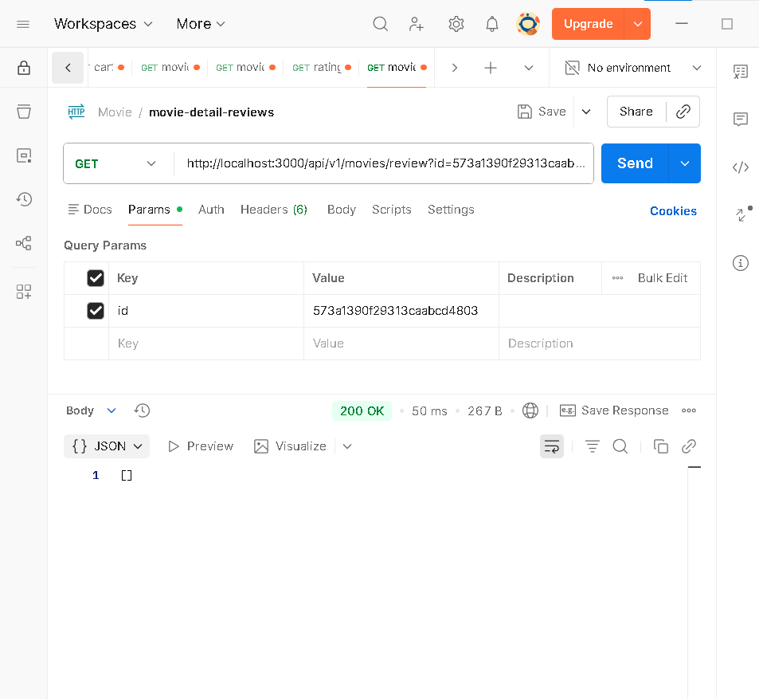
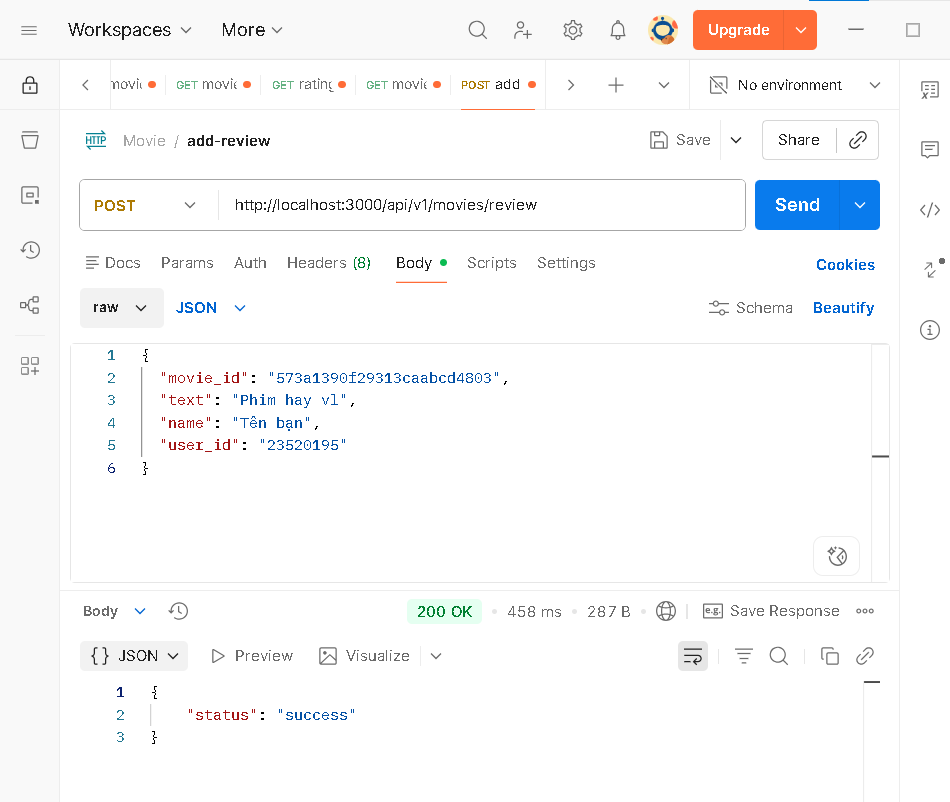
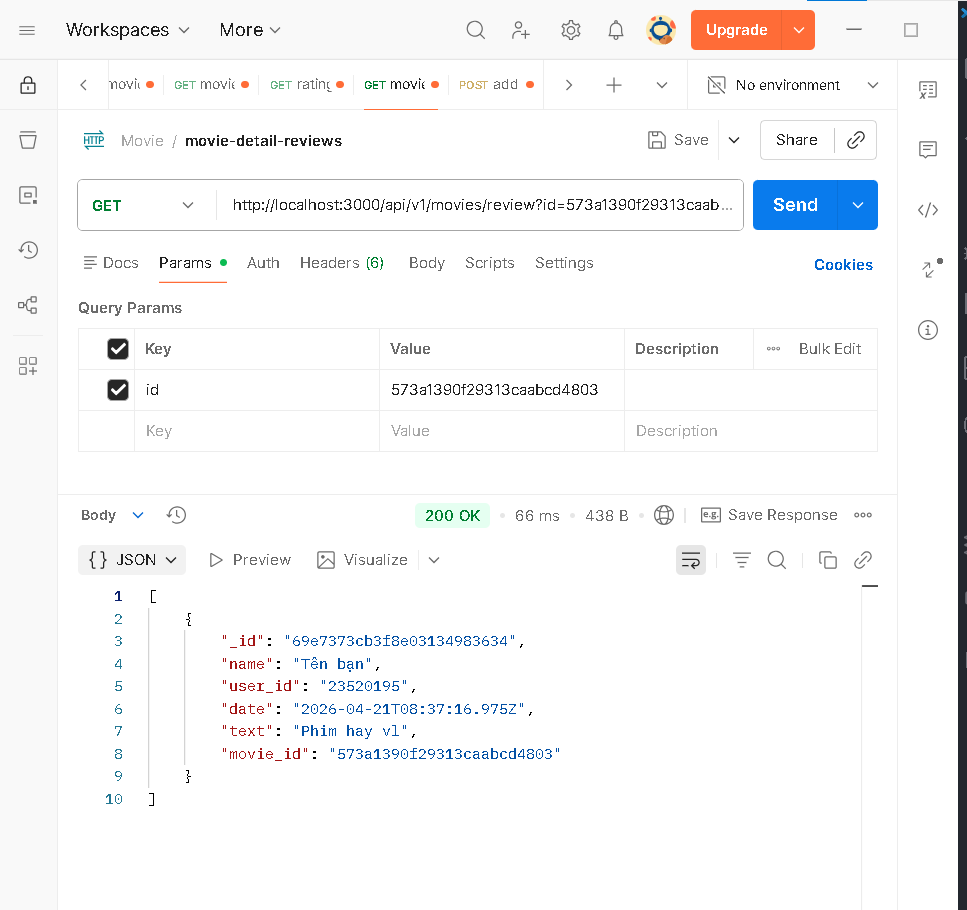
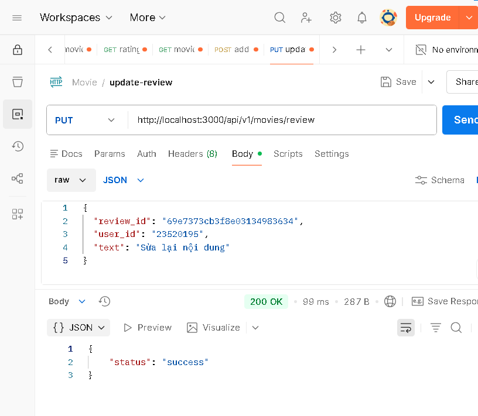
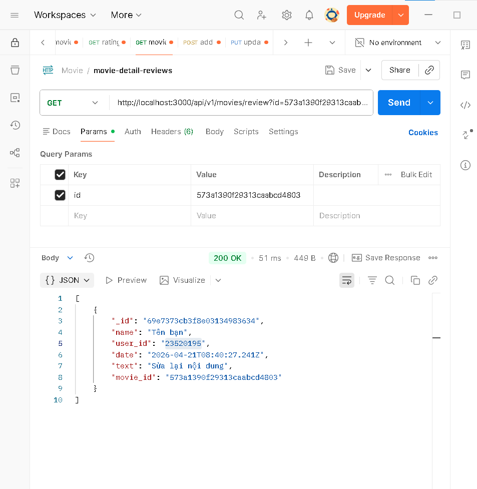
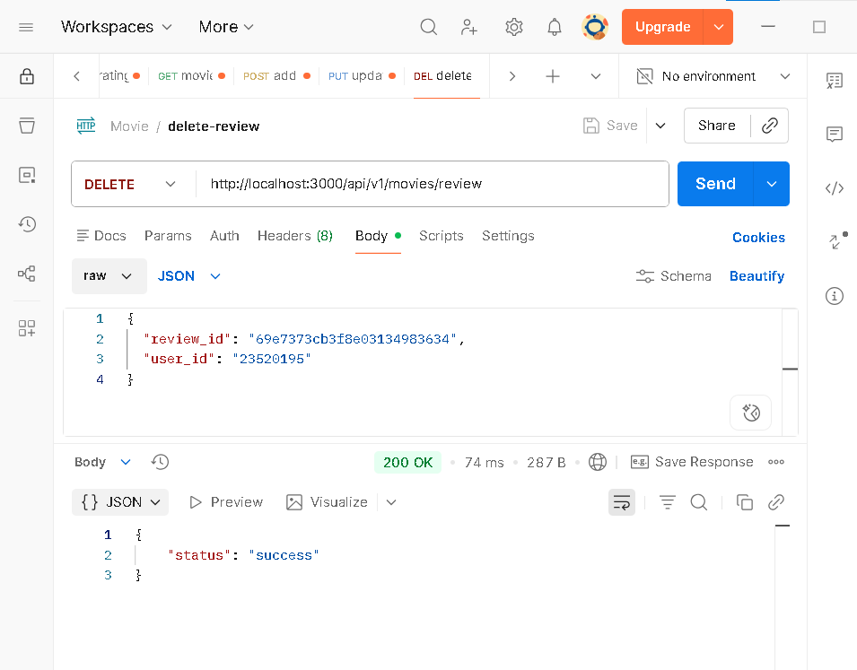
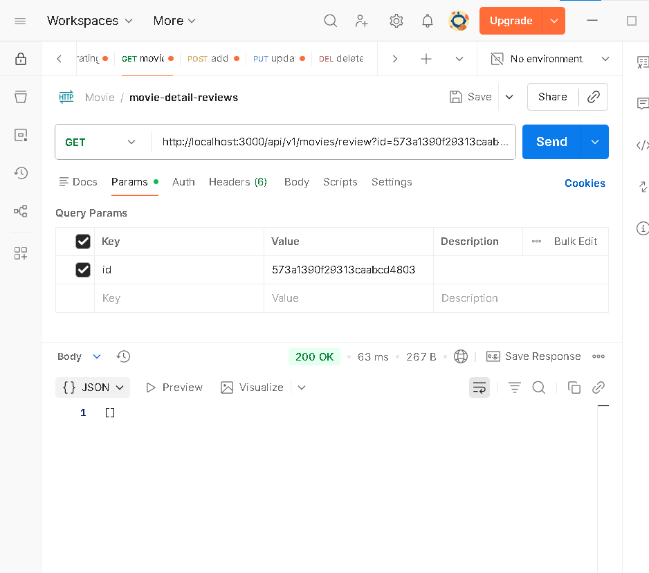
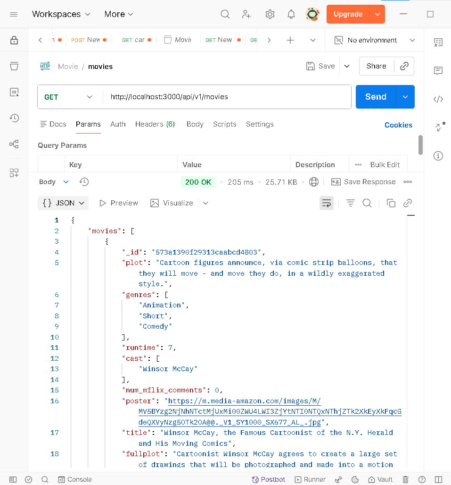
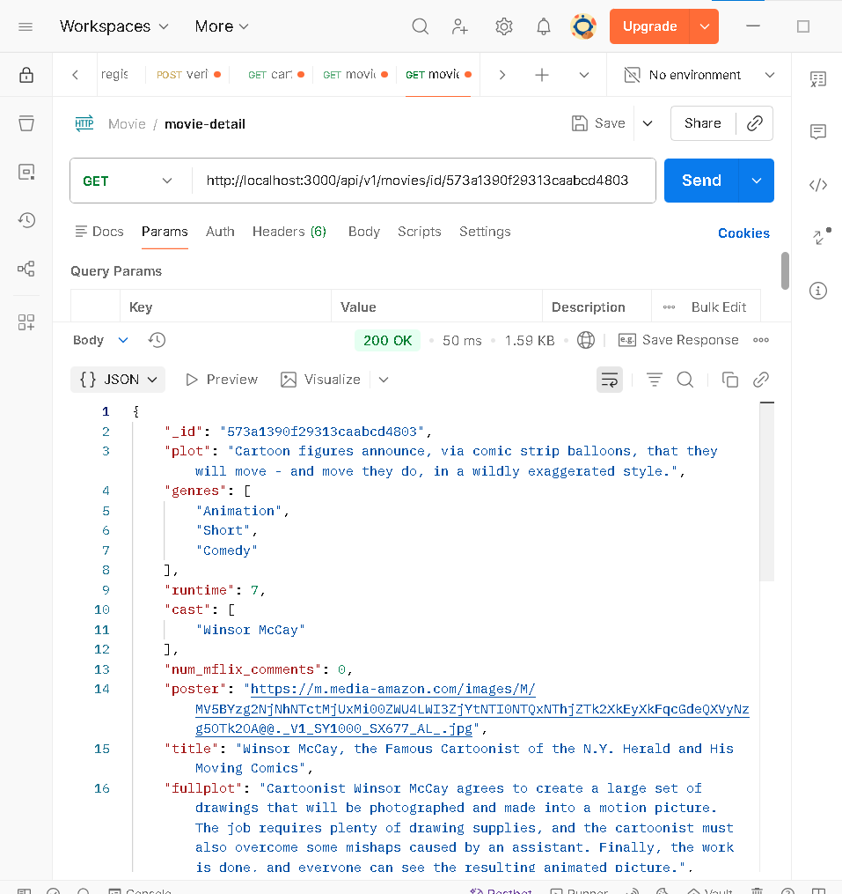
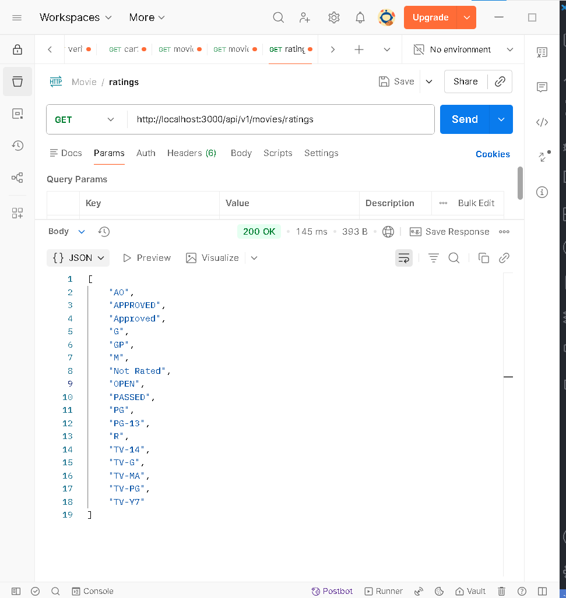

# Lab03

[Chi tiết Lab03](Lab03/README.md)

EM gói riêng 1 file README.md ở LAB02 để sai có cập nhận README tổng vẩn còn minh chứng là không chỉnh sửa lab củ. Nội Dung ở bản tổng và bản riêng LAb hoàn toàn giống nhau.
# 1. Mục tiêu
Yêu cầu

Trước khi làm bài tập này, sinh viên cần xem lại nội dung bài học Chương 2
- Phần xây dựng API cho review movie.

Mục tiêu

- Giúp sinh viên hiều được sâu sắc cách kết nối giữa các phần Controller,
Router, Data Access Object trong việc xây dựng mã nguồn.

- Giới thiệu một số phương thức trong việc gửi yêu cầu dưới dạng http từ máy
khách lên máy chủ.

- Thực hành tạo các tệp tin movies.controller.js, reviewDAO,
reviews.controller.js
# 2. Công cụ / môi trường

Các công cụ và môi trường được sử dụng trong bài thực hành:

- **MongoDB Atlas**  
  Dịch vụ cơ sở dữ liệu MongoDB trên nền tảng đám mây, dùng để tạo và quản lý cluster database.

- **MongoDB Compass**  
  Công cụ giao diện (GUI) giúp kết nối và quản lý MongoDB database trên máy tính.

- **Mongo Shell / MONGOSH**  
  Công cụ dòng lệnh dùng để thực thi các lệnh MongoDB như tạo database, thêm document, truy vấn dữ liệu.

- **Trình duyệt web (Google Chrome / Microsoft Edge / Firefox)**  
  Dùng để truy cập và quản lý MongoDB Atlas trên nền tảng web.

- **Máy tính cá nhân có kết nối Internet**  
  Dùng để cài đặt MongoDB Compass và kết nối tới MongoDB Atlas.
## 3. Cách chạy

### Bài 1: Thiết lập định tuyến cho các thao tác với review trong ứng dụng minh hoạ

#### 1.1 Định tuyến  
Tạo route `/review` trong `movies.router.js`  
→ Endpoint: `/api/v1/movies/review`  

#### 1.2 → 1.4 Thiết lập các phương thức POST, PUT, DELETE  
Sử dụng `router.route()` để gom các method vào cùng 1 endpoint  
→ Gọi các hàm trong `ReviewsController`  

```js
// import express để tạo router
const express = require("express");

// tạo router
const router = express.Router();

// Import các Controller
const MoviesCtrl = require("./movies.controller");
const ReviewsCtrl = require("./reviews.controller");

// --- CÁC ĐỊNH TUYẾN PHIM (MOVIES) ---
router.route("/").get(MoviesCtrl.apiGetMovies);

// Lấy danh sách tất cả Ratings
router.route("/ratings").get(MoviesCtrl.apiGetRatings);

// Lấy chi tiết phim theo ID
router.route("/id/:id").get(MoviesCtrl.apiGetMovieById);


// ==========================================
// BÀI TẬP 1: Thiết lập định tuyến cho Review
// ==========================================

// Định tuyến cho đường dẫn /review
router
  .route("/review")
  .post(ReviewsCtrl.apiPostReview)   // Thêm review
  .put(ReviewsCtrl.apiUpdateReview)  // Sửa review
  .delete(ReviewsCtrl.apiDeleteReview); // Xóa review

// Lấy review theo movie
router.route("/review").get(ReviewsCtrl.apiGetReviews);

// export router để dùng trong server.js
module.exports = router;
```

#### Giải thích ngắn gọn  
- `POST /review` → thêm review  
- `PUT /review` → cập nhật review  
- `DELETE /review` → xoá review  
- `GET /review` → lấy danh sách review  

→ Tất cả xử lý thông qua `ReviewsController`
### Bài 2: Thiết lập Controller cho review

#### 2.1 Tạo file controller  
Tạo file `reviews.controller.js` trong thư mục `api`  
→ Dùng để xử lý request từ client (POST, PUT, DELETE)

```js
class ReviewsController {

}
module.exports = ReviewsController;
```

**Giải thích:**  
- Controller là lớp trung gian giữa Router và DAO  
- Nhận request từ client → xử lý → trả response  

---

#### 2.2 Import DAO  
Import `reviewsDAO.js` để thao tác với database  

```js
const ReviewsDAO = require("../dao/reviewsDao");
const MoviesDAO = require("../dao/moviesDao");
```

**Giải thích:**  
- DAO chứa logic làm việc với MongoDB  
- Controller chỉ gọi lại, không viết query trực tiếp  

---

#### 2.3 Phương thức apiPostReview()  
Xử lý thêm review từ client  

```js
static async apiPostReview(req, res) {
  try {
    const movieId = req.body.movie_id;
    const review = req.body.text;

    const userInfo = {
      name: req.body.name,
      _id: req.body.user_id
    };

    const date = new Date();

    await ReviewsDAO.addReview(movieId, userInfo, review, date);

    res.json({ status: "success" });

  } catch (e) {
    res.status(500).json({ error: e.message });
  }
}
```

**Giải thích:**  
- Lấy dữ liệu từ `req.body` (client gửi lên)  
- Tạo `date` để lưu thời gian  
- Gọi `addReview()` để insert vào DB  
- Trả `{ status: "success" }` nếu thành công  

---

#### 2.4 Phương thức apiUpdateReview()  
Xử lý cập nhật review  

```js
static async apiUpdateReview(req, res) {
  try {
    const reviewId = req.body.review_id;
    const text = req.body.text;
    const date = new Date();

    const ReviewResponse = await ReviewsDAO.updateReview(
      reviewId,
      req.body.user_id,
      text,
      date
    );

    if (ReviewResponse.error) {
      return res.status(400).json({ error: ReviewResponse.error });
    }

    if (ReviewResponse.modifiedCount === 0) {
      return res.status(404).json({ error: "Unable to update review" });
    }

    res.json({ status: "success" });

  } catch (e) {
    res.status(500).json({ error: e.message });
  }
}
```

**Giải thích:**  
- Lấy `review_id` và `user_id` từ client  
- Gọi DAO để update  
- `modifiedCount === 0` → không có dữ liệu bị sửa (sai user hoặc id)  
- Trả lỗi nếu update thất bại  

---

#### 2.5 Phương thức apiDeleteReview()  
Xử lý xoá review  

```js
static async apiDeleteReview(req, res) {
  try {
    const reviewId = req.body.review_id;
    const userId = req.body.user_id;

    await ReviewsDAO.deleteReview(reviewId, userId);

    res.json({ status: "success" });

  } catch (e) {
    res.status(500).json({ error: e.message });
  }
}
```

**Giải thích:**  
- Nhận `review_id` và `user_id`  
- Gọi DAO để xoá  
- Chỉ xoá nếu đúng user tạo review  

---

#### (Bổ sung) apiGetReviews()  

```js
static async apiGetReviews(req, res) {
  try {
    const reviews = await ReviewsDAO.getReviewsByMovieId(req.query.id);
    res.json(reviews);

  } catch (e) {
    res.status(500).json({ error: e.message });
  }
}
```

**Giải thích:**  
- Lấy `movie_id` từ query  
- Trả về danh sách review theo phim  


#### Tổng kết  
- Controller = xử lý request/response  
- DAO = thao tác DB  
- Tách riêng giúp code rõ ràng, dễ bảo trì  

---
### Bài 3: Thiết lập DAO cho review

#### 3.1 Tạo file DAO  
Tạo file `reviewsDAO.js` trong thư mục `DAO`  

```js
// Import MongoDB
const mongodb = require("mongodb");
const ObjectId = mongodb.ObjectId;

// Biến tham chiếu tới collection
let reviews;
```

**Giải thích:**  
- `mongodb` dùng để làm việc với MongoDB  
- `ObjectId` dùng để ép kiểu `_id` (Mongo không dùng string)  
- `reviews` là biến giữ collection để thao tác DB  

---

#### 3.2 Phương thức injectDB()  
Kết nối tới collection `reviews`  

```js
static async injectDB(conn) {
  if (reviews) return;

  try {
    reviews = await conn.db("sample_mflix").collection("reviews");
  } catch (e) {
    console.error(`Unable to establish collection: ${e}`);
  }
}
```

**Giải thích:**  
- Nhận `conn` (MongoClient) từ `index.js`  
- Gán collection vào biến `reviews`  
- Chỉ chạy 1 lần (tránh connect lại nhiều lần)  
- Phải gọi trước khi server chạy  

---

#### 3.3 Phương thức addReview()  
Thêm review vào DB  

```js
static async addReview(movieId, user, review, date) {
  try {
    const reviewDoc = {
      name: user.name,
      user_id: user._id,
      text: review,
      date: date,
      movie_id: new ObjectId(movieId)
    };

    return await reviews.insertOne(reviewDoc);

  } catch (e) {
    console.error(`Unable to post review: ${e}`);
    return { error: e };
  }
}
```

**Giải thích:**  
- Tạo object `reviewDoc`  
- Ép `movieId` → `ObjectId`  
- Dùng `insertOne()` để thêm vào DB  
- Trả về kết quả insert  

---

#### 3.4 Phương thức updateReview()  
Cập nhật review  

```js
static async updateReview(reviewId, userId, text, date) {
  try {
    return await reviews.updateOne(
      { _id: new ObjectId(reviewId), user_id: userId },
      { $set: { text: text, date: date } }
    );

  } catch (e) {
    console.error(`Unable to update review: ${e}`);
    return { error: e };
  }
}
```

**Giải thích:**  
- Ép `reviewId` → `ObjectId`  
- Filter theo `_id` + `user_id` → đảm bảo đúng người sửa  
- `$set` để cập nhật field  
- Trả về `modifiedCount`  

---

#### 3.5 Phương thức deleteReview()  
Xoá review  

```js
static async deleteReview(reviewId, userId) {
  try {
    return await reviews.deleteOne({
      _id: new ObjectId(reviewId),
      user_id: userId
    });

  } catch (e) {
    console.error(`Unable to delete review: ${e}`);
    return { error: e };
  }
}
```

**Giải thích:**  
- Ép `reviewId` → ObjectId  
- Chỉ xoá nếu đúng `user_id`  
- Dùng `deleteOne()` để xoá  

---

#### 3.6 Kiểm thử API  
Test bằng Postman / Insomnia  

**Yêu cầu:**  
- `user_id` = MSSV  

**Test các API:**  
- POST `/review` → thêm review  
- PUT `/review` → sửa review  
- DELETE `/review` → xoá review  

---

#### (Bổ sung) Lấy review theo movie  

```js
static async getReviewsByMovieId(movieId) {
  try {
    const cursor = await reviews.find({
      movie_id: new ObjectId(movieId)
    });

    return await cursor.toArray();

  } catch (e) {
    console.error(`Unable to get reviews: ${e}`);
    return { error: e };
  }
}
```

**Giải thích:**  
- Tìm tất cả review theo `movie_id`  
- Dùng `find()` + `toArray()` để trả về danh sách 

--- 
### Bài 4: Hoàn thành back-end cho ứng dụng minh họa

#### 4.1 Thêm định tuyến  
Thêm 2 route để lấy dữ liệu phim và rating  

```js
// Lấy danh sách tất cả Ratings
router.route("/ratings").get(MoviesCtrl.apiGetRatings);

// Lấy chi tiết phim theo ID
router.route("/id/:id").get(MoviesCtrl.apiGetMovieById);
```

**Giải thích:**  
- `/ratings` → trả về danh sách rating (G, PG, R,...)  
- `/id/:id` → lấy chi tiết 1 phim theo id  
- `:id` là params (lấy bằng `req.params.id`)  

---

#### 4.2 Thêm controller  

```js
// Lấy chi tiết phim + review
static async apiGetMovieById(req, res) {
  try {
    let id = req.params.id || {};
    let movie = await MoviesDAO.getMovieById(id);

    if (!movie) {
      return res.status(404).json({ error: "Not found" });
    }

    res.json(movie);

  } catch (e) {
    res.status(500).json({ error: e.message });
  }
}

// Lấy danh sách ratings
static async apiGetRatings(req, res) {
  try {
    let ratings = await MoviesDAO.getRatings();
    res.json(ratings);

  } catch (e) {
    res.status(500).json({ error: e.message });
  }
}
```

**Giải thích:**  
- `apiGetMovieById`  
  - Lấy `id` từ URL  
  - Gọi DAO để lấy phim + review  
  - Trả 404 nếu không tồn tại  

- `apiGetRatings`  
  - Gọi DAO lấy danh sách rating  
  - Trả về dạng JSON  

---

#### 4.3 Thêm DAO  

```js
// Lấy danh sách rating
static async getRatings() {
  try {
    return await movies.distinct("rated");
  } catch (e) {
    console.error(`Unable to get ratings, ${e}`);
    return [];
  }
}

// Lấy chi tiết phim + review
static async getMovieById(id) {
  try {
    const pipeline = [
      {
        $match: {
          _id: new ObjectId(id)
        }
      },
      {
        $lookup: {
          from: "reviews",
          let: { id: "$_id" },
          pipeline: [
            {
              $match: {
                $expr: {
                  $eq: ["$movie_id", "$$id"]
                }
              }
            },
            {
              $sort: { date: -1 }
            }
          ],
          as: "reviews"
        }
      },
      {
        $addFields: {
          reviews: "$reviews"
        }
      }
    ];

    return await movies.aggregate(pipeline).next();

  } catch (e) {
    console.error(`Error: ${e}`);
    throw e;
  }
}
```

**Giải thích:**  
- `getRatings`  
  - Dùng `distinct("rated")` để lấy danh sách rating không trùng  

- `getMovieById`  
  - `$match` → lọc theo `_id`  
  - `$lookup` → join với collection `reviews`  
  - `$sort` → sắp xếp review mới nhất  
  - `aggregate()` → tổng hợp dữ liệu nhiều collection  

---

#### 4.4 Kiểm thử API  

**API cần test:**  
- GET `/api/v1/movies/id/:id`  
- GET `/api/v1/movies/ratings`  

**Kết quả mong đợi:**  
- API movie → trả về:
  - Thông tin phim  
  - Danh sách review  

- API ratings → trả về:
  - Danh sách rating (G, PG, R,...)  

---

#### Tổng kết  
- Router → định tuyến API  
- Controller → xử lý request  
- DAO → truy vấn MongoDB  
- `$lookup` → join dữ liệu giống SQL  
## 4. Kết quả đầu ra

### Danh sách API

| Method | Endpoint | Mô tả |
|--------|----------|------|
| GET | /api/v1/movies | Lấy danh sách phim |
| GET | /api/v1/movies/id/:id | Lấy chi tiết phim + review |
| GET | /api/v1/movies/ratings | Lấy danh sách rating |
| GET | /api/v1/movies/review?id=movieId | Lấy review theo movie |
| POST | /api/v1/movies/review | Thêm review |
| PUT | /api/v1/movies/review | Cập nhật review |
| DELETE | /api/v1/movies/review | Xoá review |

---

### Cách test API (Postman / Insomnia)

#### 1. Lấy danh sách phim
- Method: GET  
- URL:  
```
http://localhost:3000/api/v1/movies
```

---

#### 2. Lấy chi tiết phim + review
- Method: GET  
- URL:  
```
http://localhost:3000/api/v1/movies/id/{movieId}
```

---

#### 3. Lấy danh sách rating
- Method: GET  
- URL:  
```
http://localhost:3000/api/v1/movies/ratings
```

---

#### 4. Lấy review theo movie
- Method: GET  
- URL:  
```
http://localhost:3000/api/v1/movies/review?id={movieId}
```


---

#### 5. Thêm review
- Method: POST  
- URL:  
```
http://localhost:3000/api/v1/movies/review
```

- Body (JSON):
```json
{
  "movie_id": "ID_PHIM",
  "text": "Phim hay vl",
  "name": "Tên bạn",
  "user_id": "MSSV"
}
```


---

#### 6. Cập nhật review
- Method: PUT  
- URL:  
```
http://localhost:3000/api/v1/movies/review
```

- Body (JSON):
```json
{
  "review_id": "ID_REVIEW",
  "user_id": "MSSV",
  "text": "Sửa lại nội dung"
}
```


---

#### 7. Xoá review
- Method: DELETE  
- URL:  
```
http://localhost:3000/api/v1/movies/review
```

- Body (JSON):
```json
{
  "review_id": "ID_REVIEW",
  "user_id": "MSSV"
}
```


---

### Chỗ chèn ảnh kết quả

#### GET movies


#### GET movie by id


#### GET ratings


#### POST review


#### PUT review


#### DELETE review


## 5. Giải thích chính
1. Client (Postman / trình duyệt) gửi request tới API  
2. Router nhận request và định tuyến đến Controller tương ứng  
3. Controller:
   - Lấy dữ liệu từ `req` (body, params, query)  
   - Xử lý logic cơ bản  
   - Gọi các hàm trong DAO  
4. DAO:
   - Kết nối MongoDB (qua `injectDB`)  
   - Thực hiện truy vấn (`find`, `insertOne`, `updateOne`, `deleteOne`, `aggregate`)  
5. Kết quả trả ngược lại:
   - DAO → Controller → Client (JSON)

---

### Ý nghĩa từng phần

- **Router**  
  Định nghĩa các endpoint API (GET, POST, PUT, DELETE)

- **Controller**  
  Xử lý request/response, không làm việc trực tiếp với DB  

- **DAO (Data Access Object)**  
  Tầng thao tác dữ liệu với MongoDB  

- **MongoDB**  
  Lưu trữ dữ liệu phim (`movies`) và review (`reviews`)  

---

### Luồng cụ thể ví dụ (Thêm review)

1. Client gửi POST `/review` kèm dữ liệu  
2. Router → `apiPostReview`  
3. Controller lấy dữ liệu → gọi `addReview()`  
4. DAO dùng `insertOne()` lưu vào DB  
5. Trả `{ status: "success" }` về client  

---

### Điểm quan trọng

- Tách 3 lớp: Router → Controller → DAO → dễ bảo trì  
- Dùng `ObjectId` để đúng kiểu dữ liệu MongoDB  
- Dùng `$lookup` để join `movies` và `reviews`  
- API trả JSON → dễ test bằng Postman/Insomnia 