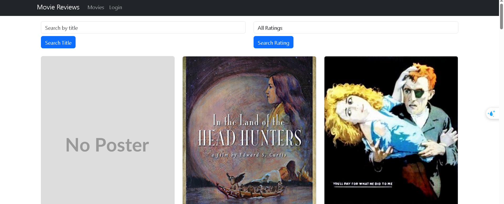
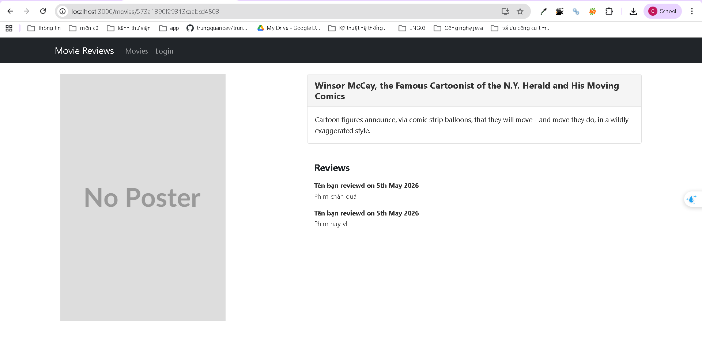
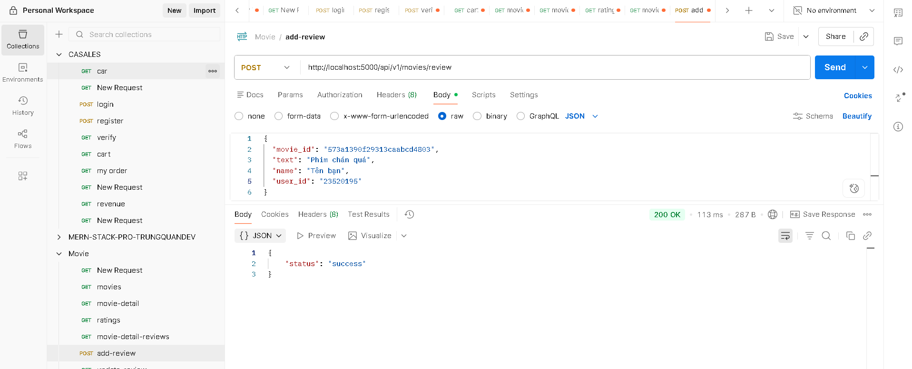

# Lab05
Lưu ý  backend sử dụng port 5000.
## 1. Mục tiêu
- Giúp sinh viên hiểu được cách kết nối từ fe tới be với reactjs.

- Giới thiệu một số package chủ yếu trong việc xây dựng mã nguồn fe.

- Tạo các form để người dùng nhập vào tìm kiếm dữ liệu.

- Hiển thị danh sách movie thông qua các component của React-bootstrap

như Card, Link, Switch, Route.

- Giới thiệu các hook như useState() và useEffect() trong Reactjs.

- Hiển thị một trang chi tiết về Movie (ứng dụng minh hoạ).

- Hiển thị các review có liên quan đến Movie.

## 2. Công cụ / môi trường

Phần này mô tả các công cụ, thư viện và thiết lập môi trường đã được sử dụng để xây dựng Frontend cho dự án Movie Review.

### 2.1. Môi trường hệ thống
* **Node.js**: Phiên bản LTS (đã cài đặt để quản lý các gói thư viện).
* **NPM (Node Package Manager)**: Sử dụng để cài đặt và quản lý các phụ thuộc (dependencies).
* **Hệ điều hành**: Windows (sử dụng Terminal `MINGW64/Git Bash`).

### 2.2. Công cụ lập trình
* **Trình soạn thảo**: Visual Studio Code (VS Code).
* **Tiện ích hỗ trợ**:
    * *ES7+ React/Redux/React-Native snippets*: Hỗ trợ tạo nhanh cấu trúc Component.
    * *Prettier*: Định dạng mã nguồn chuẩn hóa.
* **Trình duyệt**: Google Chrome / Microsoft Edge cùng với **React Developer Tools** để debug.

### 2.3. Các thư viện chính đã cài đặt (Frontend)
Dự án đã sử dụng các package sau để xây dựng giao diện và điều hướng:

| Thư viện | Phiên bản | Công dụng |
| :--- | :--- | :--- |
| **React** | ^18.x | Thư viện chính xây dựng giao diện người dùng. |
| **Bootstrap** | ^5.x | Cung cấp CSS framework để xây dựng UI nhanh chóng. |
| **React-Bootstrap** | ^2.x | Các Component Bootstrap được tối ưu hóa cho React (Navbar, Container, Nav). |
| **React-Router-Dom** | ^6.x | Thư viện xử lý định tuyến (Routing), giúp chuyển trang mà không tải lại. |

### 2.4. Lệnh thiết lập môi trường đã thực hiện
Để thiết lập dự án từ đầu, các câu lệnh sau đã được thực thi thành công:

```bash
# 1. Khởi tạo template React
npx create-react-app frontend

# 2. Di chuyển vào thư mục frontend
cd frontend

# 3. Cài đặt các thư viện bổ trợ
npm install bootstrap react-bootstrap react-router-dom

```
Hãy giữ nguyên file package.json ban đầu của bạn.
Mở terminal tại thư mục frontend và chạy lệnh:
```
npm install axios moment
```

Khởi chạy ứng dụng ở chế độ phát triển
```
npm start
```
http://localhost:3000
---
## 3. Cách chạy
http://localhost:3000
### Bài 1: Kết nối tới Backend.

### 1.1 Cài đặt axios cho dự án hiện tại.

Cài đặt axios để gửi request HTTP và moment để xử lý thời gian.

Hãy giữ nguyên file package.json ban đầu của bạn.
Mở terminal tại thư mục frontend và chạy lệnh:
```
npm install axios moment
```
Lưu ý  backend sử dụng port 5000.

---
### 1.2 Tạo lớp dịch vụ có tên MovieDataService trong thư mục .src/services/movies.js và 1.3 Tạo các lời gọi dịch vụ tới backend, sử dụng axios để gọi bao gồm:
Tạo file ./src/services/movie.js để quản lý các lời gọi API tập trung:
```js
import axios from "axios";

// Cấu hình URL cơ sở của Backend (Port 5000)
const http = axios.create({
  baseURL: "http://localhost:5000/api/v1/movies",
  headers: {
    "Content-type": "application/json"
  }
});

class MovieDataService {
  getAll(page = 0) {
    return http.get(`?page=${page}`);
  }
  get(id) {
    return http.get(`/id/${id}`);
  }
  find(query, by = "title", page = 0) {
    return http.get(`?${by}=${query}&page=${page}`);
  }
  createReview(data) {
    return http.post("/review", data);
  }
  updateReview(data) {
    return http.put("/review", data);
  }
  deleteReview(id, userId) {
    return http.delete(`/review?id=${id}`, { data: { user_id: userId } });
  }
  getRatings() {
    return http.get(`/ratings`);
  }
}

export default new MovieDataService();
```

---
### Bài 2: Xây dựng MoviesList Component.
---
### 2.1 Tạo các biến trạng thái: movies, searchTitle, searchRating, ratings sử dụng useState().
---
### 2.2 Tạo 2 phương thức retrieveMovies() và retrieveRatings() để lấy thông tin movie cùng danh
---
### sách các loại ratings. Và dùng useEffect() để gọi chung sau khi giao diện kết xuất xong.
---
### 2.3 Tạo 2 search form gồm tìm theo title, và tìm theo rating.
---
### 2.4 Hiển thị các movie bằng <Card> của React-bootstrap.
---
### 2.5 Hiện thực 2 phương thức findByTitle() và findByRating() để tìm phim theo Title hoặc

Component này có nhiệm vụ hiển thị danh sách tất cả các phim, cho phép tìm kiếm theo tên hoặc lọc theo Rating.

Mã nguồn hiện thực:
```js
import React, { useState, useEffect } from 'react';
import MovieDataService from '../../services/movie'; // Đường dẫn tới file service bạn đã tạo
import { Link } from 'react-router-dom';
import { Form, Button, Col, Row, Container, Card } from 'react-bootstrap';

const MoviesList = () => {
  // 2.1 Tạo các biến trạng thái
  const [movies, setMovies] = useState([]);
  const [searchTitle, setSearchTitle] = useState("");
  const [searchRating, setSearchRating] = useState("");
  const [ratings, setRatings] = useState(["All Ratings"]);

  // 2.2 Gọi chung các hàm lấy dữ liệu sau khi giao diện kết xuất xong
  useEffect(() => {
    retrieveMovies();
    retrieveRatings();
  }, []);

  const retrieveMovies = () => {
    MovieDataService.getAll()
      .then(response => {
        setMovies(response.data.movies);
      })
      .catch(e => {
        console.log(e);
      });
  };

  const retrieveRatings = () => {
    MovieDataService.getRatings()
      .then(response => {
        // Thêm "All Ratings" vào đầu mảng danh sách ratings lấy từ backend
        setRatings(["All Ratings"].concat(response.data));
      })
      .catch(e => {
        console.log(e);
      });
  };

  // Các hàm cập nhật giá trị ô tìm kiếm
  const onChangeSearchTitle = e => {
    const searchTitle = e.target.value;
    setSearchTitle(searchTitle);
  };

  const onChangeSearchRating = e => {
    const searchRating = e.target.value;
    setSearchRating(searchRating);
  };

  // 2.5 Phương thức tìm phim theo Title và Rating
  const find = (query, by) => {
    MovieDataService.find(query, by)
      .then(response => {
        setMovies(response.data.movies);
      })
      .catch(e => {
        console.log(e);
      });
  };

  const findByTitle = () => {
    find(searchTitle, "title");
  };

  const findByRating = () => {
    if (searchRating === "All Ratings") {
      retrieveMovies();
    } else {
      find(searchRating, "rated");
    }
  };

  return (
    <Container>
      {/* 2.3 Tạo 2 search form gồm tìm theo title, và tìm theo rating */}
      <Form>
        <Row className="mb-4">
          <Col>
            <Form.Group>
              <Form.Control
                type="text"
                placeholder="Search by title"
                value={searchTitle}
                onChange={onChangeSearchTitle}
              />
            </Form.Group>
            <Button variant="primary" type="button" onClick={findByTitle} className="mt-2">
              Search Title
            </Button>
          </Col>
          <Col>
            <Form.Group>
              <Form.Control as="select" onChange={onChangeSearchRating}>
                {ratings.map((rating, index) => {
                  return (
                    <option value={rating} key={index}>
                      {rating}
                    </option>
                  );
                })}
              </Form.Control>
            </Form.Group>
            <Button variant="primary" type="button" onClick={findByRating} className="mt-2">
              Search Rating
            </Button>
          </Col>
        </Row>
      </Form>

      {/* 2.4 Hiển thị các movie bằng <Card> của React-bootstrap */}
      <Row>
        {movies.map((movie) => {
          return (
            <Col key={movie._id} md={4} className="mb-4">
              <Card>
                <Card.Img
                  variant="top"
                  src={movie.poster + "/100px180"}
                  onError={(e) => {
                    // Ngắt sự kiện onError để tránh vòng lặp vô tận
                    e.target.onerror = null;
                    // Đổi sang một dịch vụ placeholder khác
                    e.target.src = "/NoPoster.svg";
                  }}
                />
                <Card.Body>
                  <Card.Title>{movie.title}</Card.Title>
                  <Card.Text>
                    <strong>Rating: </strong>{movie.rated}<br />
                    <strong>Plot: </strong>{movie.plot ? movie.plot.substring(0, 100) + "..." : "No plot available"}
                  </Card.Text>
                  <Link to={"/movies/" + movie._id}>
                    <Button variant="primary">View Reviews</Button>
                  </Link>
                </Card.Body>
              </Card>
            </Col>
          );
        })}
      </Row>
    </Container>
  );
};

export default MoviesList;

```

useState: Quản lý danh sách movies, ratings và các từ khóa tìm kiếm.

useEffect: Tự động gọi retrieveMovies() và retrieveRatings() khi trang web vừa tải xong.

Card (React-bootstrap): Hiển thị Poster, tiêu đề và tóm tắt nội dung phim.


---
### Bài 3. Hiển thị thông tin trang movie khi nhấn vào ‘View Reviews’.
---
### 3.1 Thiết lập mã nguồn cho component Movie trong tệp tin ./components/movie.js gồm:
---
### - Biến trạng thái movie để lưu trữ thông tin chi tiết của movie như id, title, rated, reviews.
---
### 3.2 Xây dựng mã nguồn cho phương thức getMovie() trong component này để gọi phương
---
### thức get() trong MovieDataService.
---
### 3.3 Trang trí cho phần JSX trả về để hiển thị như hình:
---

Khi người dùng nhấn vào nút "View Reviews", ứng dụng sẽ chuyển hướng tới trang chi tiết phim dựa trên ID.

3.1 & 3.2 Khởi tạo trạng thái và lấy dữ liệu
Sử dụng useParams để lấy ID từ URL và gọi API get(id) từ service.

3.3 Giao diện chi tiết phim
Sử dụng hệ thống Grid (Row, Col) của Bootstrap để chia màn hình:

Bên trái (Col-5): Hiển thị Poster phim. Nếu không tải được hiện 1 ảnh mặc định.

Bên phải (Col-7): Hiển thị Tiêu đề, Nội dung (Plot) và danh sách Review.




### Bài 4. Hiển thị danh sách review tương ứng cho từng phim dưới phần Plot.
---
### 4.1 Viết đoạn mã nguồn JSX cho phép hiển thị danh sách review cho phim.

Duyệt mảng movie.reviews để hiển thị tên người dùng, nội dung và ngày tháng.

---
### 4.2 Xem lại slide 73 – chương 2 để hiểu cách thêm 1 review cho phim, và tiến hành thêm một số review thông qua các công cụ hỗ trợ như Postman, Insomnia.


Thêm review bằng cách:

---
### 4.2 Điều chỉnh lại cách hiển thị giờ với momentjs.
Thay vì hiển thị định dạng ngày thô từ database, chúng ta sử dụng moment để format cho thân thiện với người dùng:
```js
moment(review.date).format("Do MMMM YYYY")
```


---
--- 
## 4. Kết quả đầu ra


## 5. Giải thích chính
Không có gì đặc biệt em chỉ thêm ảnh mặc định khi tải ảnh không thành công.
và cấu hình sử lỗi tải vô tận khi error bằng.
```js
onError={(e) => {
   e.target.onerror = null;
  // Đổi sang một dịch vụ placeholder khác
   e.target.src = "/NoPoster.svg";
}}
```


---
