# Lab06
Lưu ý  backend sử dụng port 5000.
## 1. Mục tiêu
Giúp sinh viên hiểu cách MERN stack hoạt động thông qua một số sự kiện
như:
- Thêm/Xoá/Sửa review từ frontend.
- Lấy dữ liệu movie theo từng trang, và theo các tiêu chí tìm kiếm như dùng
Title, Rating.
---
## 2. Công cụ / môi trường

Phần này mô tả các công cụ, thư viện và thiết lập môi trường đã được sử dụng để xây dựng Frontend cho dự án Movie Review.

### 2.1. Môi trường hệ thống
* **Node.js**: Phiên bản LTS (đã cài đặt để quản lý các gói thư viện).
* **NPM (Node Package Manager)**: Sử dụng để cài đặt và quản lý các phụ thuộc (dependencies).
* **Hệ điều hành**: Windows (sử dụng Terminal `MINGW64/Git Bash`).

### 2.2. Công cụ lập trình
* **Trình soạn thảo**: Visual Studio Code (VS Code).
* **Tiện ích hỗ trợ**:
    * *ES7+ React/Redux/React-Native snippets*: Hỗ trợ tạo nhanh cấu trúc Component.
    * *Prettier*: Định dạng mã nguồn chuẩn hóa.
* **Trình duyệt**: Google Chrome / Microsoft Edge cùng với **React Developer Tools** để debug.

### 2.3. Các thư viện chính đã cài đặt (Frontend)
Dự án đã sử dụng các package sau để xây dựng giao diện và điều hướng:

| Thư viện | Phiên bản | Công dụng |
| :--- | :--- | :--- |
| **React** | ^18.x | Thư viện chính xây dựng giao diện người dùng. |
| **Bootstrap** | ^5.x | Cung cấp CSS framework để xây dựng UI nhanh chóng. |
| **React-Bootstrap** | ^2.x | Các Component Bootstrap được tối ưu hóa cho React (Navbar, Container, Nav). |
| **React-Router-Dom** | ^6.x | Thư viện xử lý định tuyến (Routing), giúp chuyển trang mà không tải lại. |

### 2.4. Lệnh thiết lập môi trường đã thực hiện
Để thiết lập dự án từ đầu, các câu lệnh sau đã được thực thi thành công:

```bash
# 1. Khởi tạo template React
npx create-react-app frontend

# 2. Di chuyển vào thư mục frontend
cd frontend

# 3. Cài đặt các thư viện bổ trợ
npm install 

# 4. Hoặc Cài đặt các thư viện bổ trợ
npm install bootstrap react-bootstrap react-router-dom

```
Hãy giữ nguyên file package.json ban đầu của bạn.
Mở terminal tại thư mục frontend và chạy lệnh:
```
npm install axios moment
```

Khởi chạy ứng dụng ở chế độ phát triển
```
npm start
```
http://localhost:3000
---
## 3. Cách chạy
http://localhost:3000

Bài 1: Thêm và Sửa Review.

1.1 Tạo login component.
Yêu cầu khi thiết lập login component thì khi người dùng đăng nhập thành công, họ sẽ thấy
được các chức năng như Edit và Delete review của chính họ.
Sau khi login thành công, người dùng sẽ được redirect về lại trang Home.

Mục đích: Xác thực người dùng cơ bản. Chỉ khi đăng nhập, người dùng mới có quyền thêm review hoặc chỉnh sửa/xóa các review do chính mình tạo.

Cấu hình:

Sử dụng React hook useState để quản lý biến name và id nhập từ form.

Sử dụng hook useNavigate từ react-router-dom (phiên bản v6) để điều hướng người dùng.

Hàm login() sau khi lưu thông tin người dùng vào state global của App.js sẽ tự động redirect về trang chủ (/).

Chính sách là giả lặp đăng nhập bằng cách lưu id ở local mở quyền xóa chỉnh sửa cho người dùng bằng cách so sánh id:

Khi đăng nhập

Đăng nhập thành công.
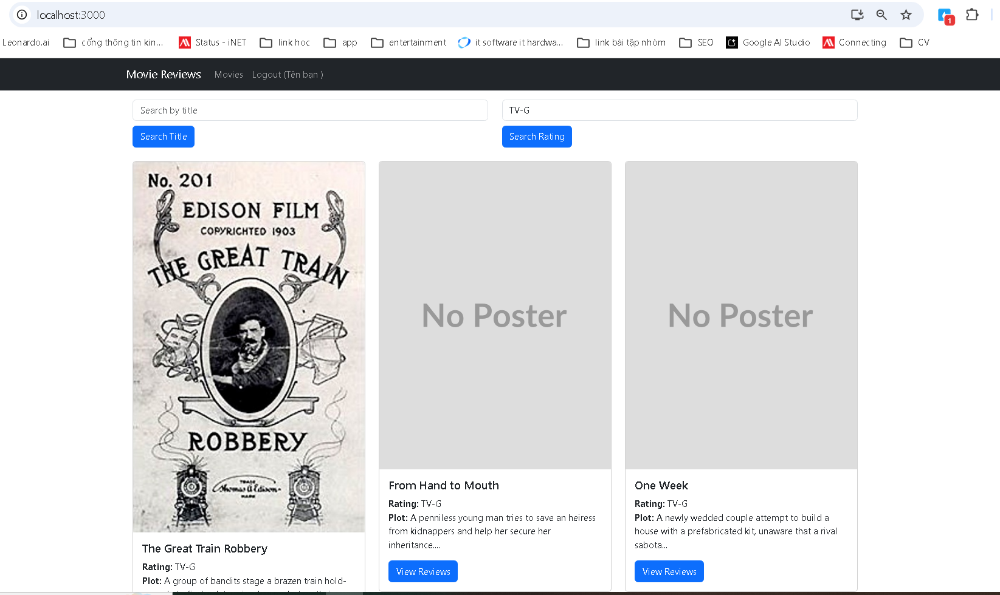
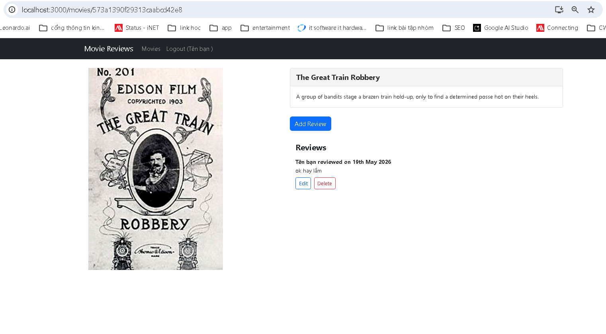
1.2 Thêm review
Tạo các biến như hướng dẫn sau:
- Biến editing sẽ có giá trị true khi component đang ở chế độ Editing.
- Ngược lại là chế độ thêm review.
- Biến trạng thái review được thiết lập thông qua biến initialReviewState.
- Trong chế độ editing, initialReviewState sẽ được thiết lập có nội dung text.
- Biến trạng thái submitted để theo dấu nếu như có một review được thêm mới.
Tạo các hàm phù hợp:
- Hàm onChangeReview() theo vết khi người dùng thêm giá trị review dưới form.
- Hàm saveReview() được gọi khi nút submit được nhấn.

- Trong hàm này, đầu tiên ta tạo một object tên data chứa các giá trị thuộc tính của
review.
- 2 giá trị name và user_id sẽ nhận từ props được gửi từ App.js.
- Lấy movie_id trực tiếp từ url (xem lại nội dung movie.js).
- Sau đó gọi hàm createReview(data) trong MovieDataServiece.
- Định tuyến này gọi tới ReviewsController trong backend và gọi
apiPostReview(), trích xuất data từ request’s body params.
Phần return() chứa nội dung JSX giúp hiển thị và xử lý tính năng thêm review:

Mục đích: Cho phép người dùng đã đăng nhập viết bài đánh giá cho một bộ phim.

Cấu hình trong AddReview.js:

- Trích xuất movie_id trực tiếp từ URL thông qua useParams().

- Khởi tạo các state: review (lưu nội dung text), submitted (kiểm tra trạng thái đã gửi thành công hay chưa) và editing (mặc định là false đối với chế độ thêm mới).

- Hàm onChangeReview() cập nhật state review realtime khi người dùng nhập liệu.

- Hàm saveReview() đóng gói dữ liệu (text, name, user_id, movie_id) và gọi API MovieDataService.createReview().

- Nếu submitted là true, giao diện sẽ ẩn form và hiển thị nút quay lại trang thông tin phim.

Lúc vào chỉnh sửa.
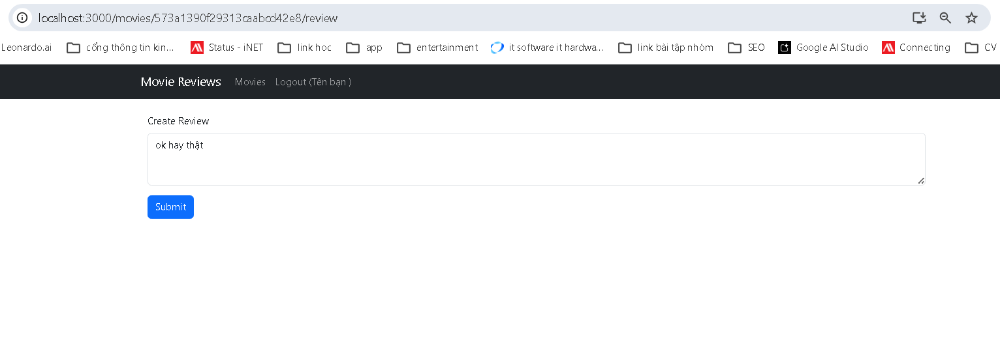
Lúc chỉnh sửa thành công.
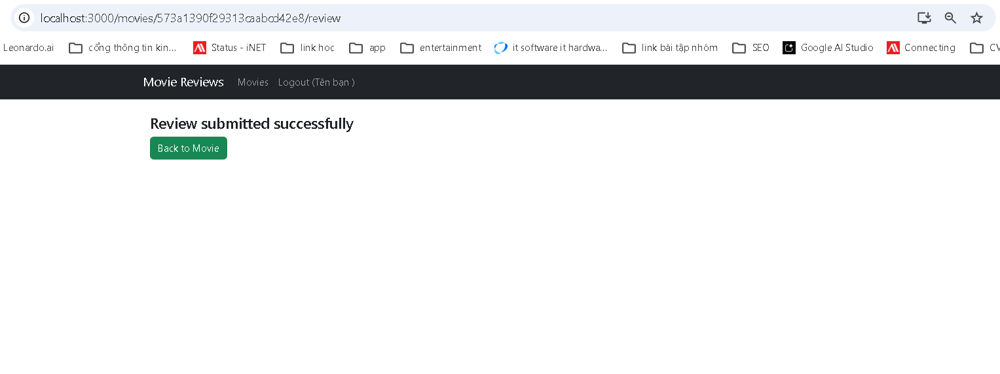
Kết quả.
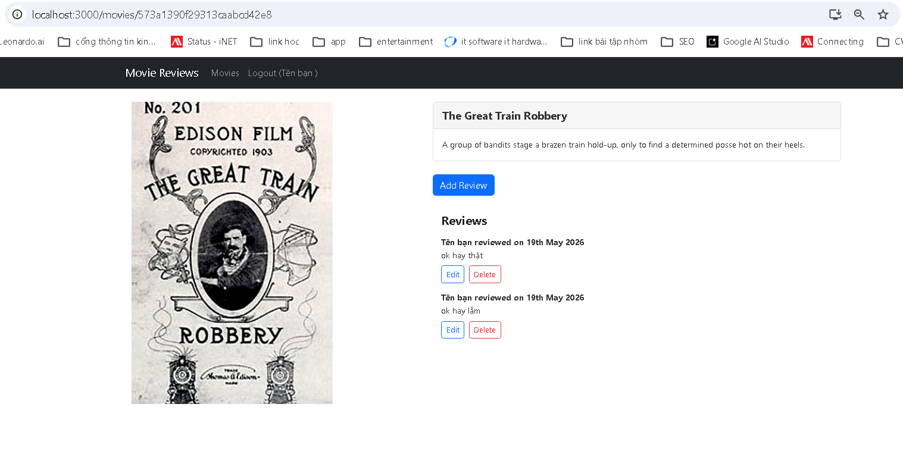
1.3 Sửa review
Viết mã nguồn thực hiện các việc sau:
- Đầu tiên, kiểm tra trạng thái truyền vào cho AddReview (xem lại tệp tin movie.js sẽ thấy prop
state).
- Nếu state được truyền vào chứa thuộc tính currentReview thì chuyển editing thành true và
initialReviewState thành currentReview.review.
- Nếu editing là true thì gọi updateReview() trong MovieDataService.
- Phương thức apiUpdateReview() trong ReviewsController ở backend sẽ được gọi, tương tự
apiPostReview.
Chạy ứng dụng sẽ cho phép cập nhật lại review
Mục đích: Tái sử dụng component AddReview để chỉnh sửa review đã tồn tại.

Cấu hình trong AddReview.js và Movie.js:

Nút "Edit" tại component Movie truyền dữ liệu của review hiện tại qua prop state của <Link> (state={{ currentReview: review }}).

Component AddReview sử dụng hook useLocation() để bắt dữ liệu này. Nếu tồn tại location.state.currentReview, chế độ editing được bật thành true và initialReviewState được gán bằng nội dung cũ.

Tại hàm saveReview(), nếu editing === true, thay vì tạo mới, hệ thống gọi MovieDataService.updateReview() và đính kèm review_id để cập nhật dữ liệu trên database.
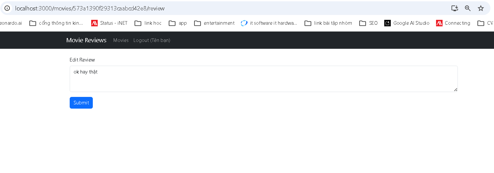

Bài 2: Xoá review
Thêm mã nguồn vào movie.js để xử lý phần xoá review:
- Trong nút delete, ta truyền review id và index chúng ta nhận được từ movie.reviews.map()
vào phương thức deleteReview().
- Trong phương thức deleteReview(), ta gọi hàm deleteReview() trong MovieDataService.
- Sau đó, tạo một callback .then() sẽ được gọi sau khi deleteReview() được gọi xong.
- Trong callback này, ta lấy mảng các reviews trong trạng thái hiện tại. Sau đó cung cấp index
của review sẽ bị xoá cho phương thức splice() để xoá nó đi.
- Cuối cùng là cập nhật lại mảng reviews như là trạng thái mới.
Chạy lại ứng dụng -> log in -> chọn một movie cụ thể có review mà mình đã đăng.

Mục đích: Cho phép người dùng xóa bài đánh giá của chính mình.

Cấu hình trong Movie.js:

- Nút Delete chỉ hiển thị khi user.id === review.user_id.

- Khi click, hàm deleteReview(reviewId, index) được gọi.

- Hàm này kích hoạt MovieDataService.deleteReview() truyền vào reviewId và user.id (để backend xác thực quyền).

- Cập nhật UI bất biến (Immutable State): Thay vì dùng splice() có thể gây đột biến state trực tiếp, mã nguồn đã áp dụng phương pháp tối ưu hơn của React là dùng .filter() để tạo ra mảng review mới loại bỏ ID vừa xóa, sau đó gán lại thông qua setMovie(). Giao diện sẽ tự động load lại danh sách review mà không cần f5.
Lúc chưa xóa "ok hay lắm".
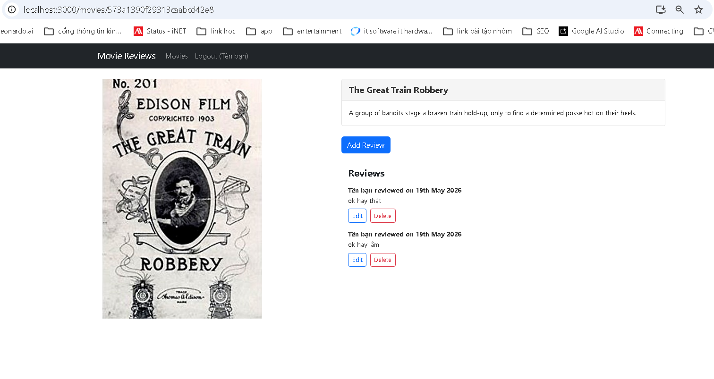
Lúc xóa "ok hay lắm" rồi.
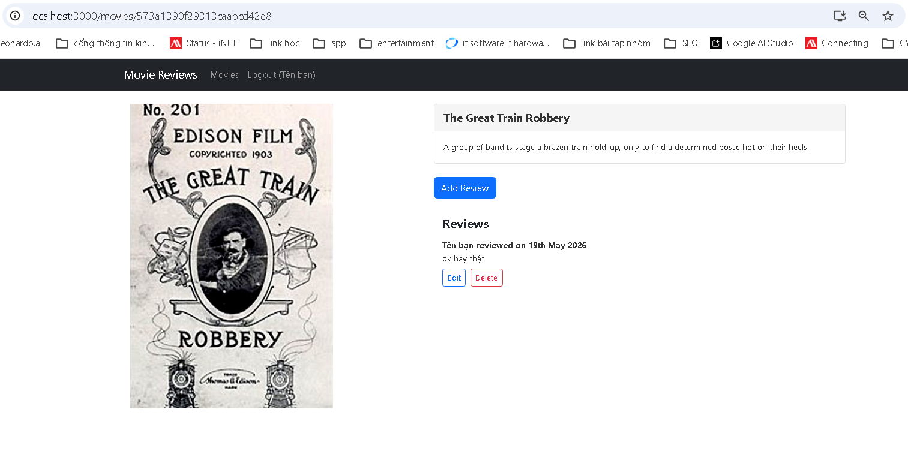
Bài 3: Lấy dữ liệu cho trang tiếp theo
3.1 getAll()
Trong component movies-list.js thêm mã nguồn để thực hiện yêu cầu.
- Thêm 2 biến trạng thái currentPage và entriesPerPage.
- Thiết lập 2 biến trạng thái này trong phương thức retrieveMovies().
- Thêm một useEffect hook:
useEffect(() => {
retrieveMovies();

}, [currentPage]);
- Biến trạng thái currentPage được truyền trong tham số thứ 2 (trong mảng) nhằm mục
đích khi giá trị của nó thay đổi thì hàm retrieveMovies() sẽ được gọi.
- Quan trọng: nhớ truyền currentPage vào lời gọi MovieDataService.get().
- Đồng thời, thêm đoạn mã xử lý vào hàm return().

Mục đích: Tránh load toàn bộ phim cùng lúc, chia nhỏ ra từng trang (pagination).

Cấu hình trong MoviesList.js:

- Bổ sung state currentPage và entriesPerPage.

- Thêm useEffect theo dõi biến currentPage: useEffect(() => { retrieveNextPage(); }, [currentPage]);. Mỗi khi chuyển trang, API sẽ được gọi lại để lấy dữ liệu mới.

- Giao diện thêm 2 nút "Previous" và "Next" để thay đổi giá trị của currentPage. Nút "Previous" được vô hiệu hóa khi ở trang 0.

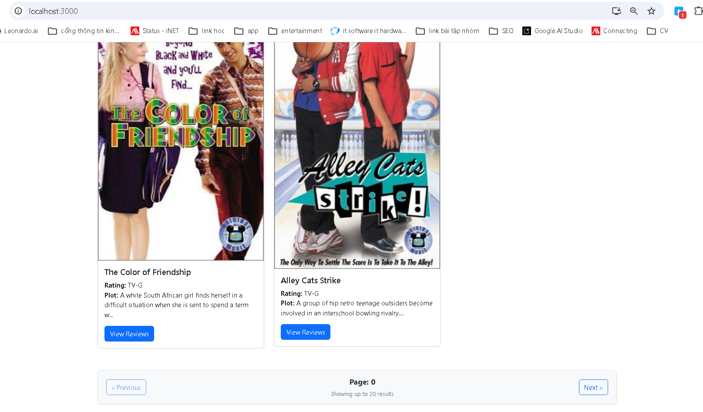
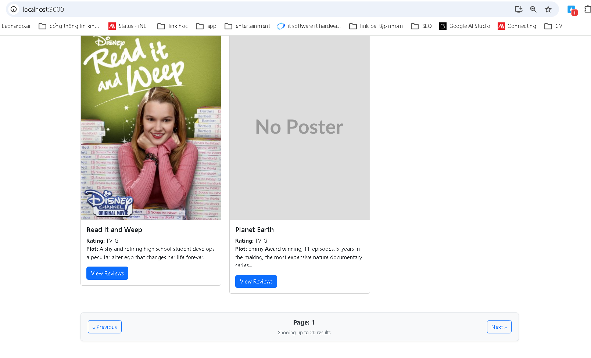
3.2 find()
Trong movies-list.js ta điều chỉnh mã nguồn theo các yêu cầu sau:
- Đầu tiên, tạo biến trạng thái currentSearchMode để nhận 2 giá trị “findByTitle” hoặc
“findByRating”.
- Sử dụng một useEffect() để khi nào currentSearchMode thay đổi thì thiết lập lại
currentPage về 0.
- Tạo phương thức mới retrieveNextPage() -> dựa vào currentSearchMode để gọi các
hàm tương ứng.
- Thêm tham số currentPage vào trong lời gọi MovieDataService.find().
- Lần lượt thêm các dòng mã lệnh setCurrentSearchMode() tương ứng vào 3 phương
thức điều khiển:

- retrieveMovies();
- findByTitle();
- findByRating();
--- 

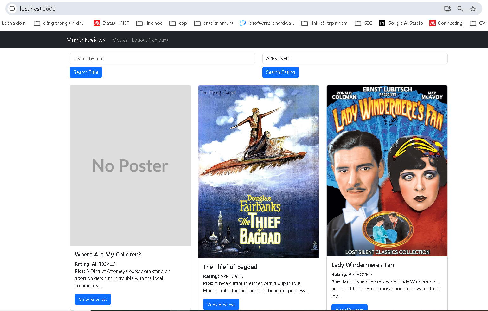
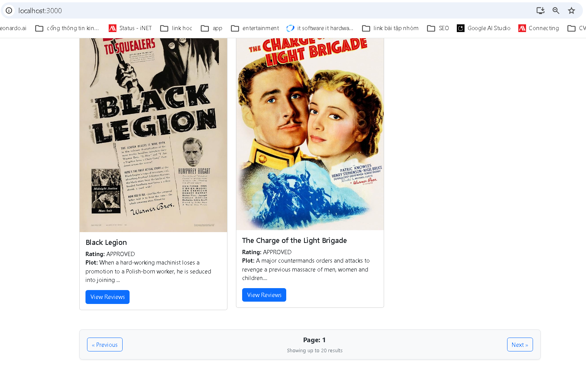
---
## 4. Kết quả đầu ra

Khi đăng nhập

Đăng nhập thành công.

Trang chi tiết 1 bộ.


Lúc vào tạo review.

Lúc chỉnh sửa thành công.

Kết quả.

Lúc chỉnh sửa thay vì tạo mới.


Lúc chưa xóa "ok hay lắm".

Lúc xóa "ok hay lắm" rồi.


Xem phân trang và chuyển trang ở cuối.

Sang trang 1.

Lúc lọc bằng filter.


Vừa lọc vừa chuyển trang.

---
## 5. Giải thích chính

### Tổng hợp các cơ chế tối ưu và chống Spam

Các tính năng này giúp ứng dụng hoạt động mượt mà hơn, tránh sập server do request liên tục và cải thiện Trải nghiệm Người dùng (UX).

| Tính năng / Best Practice | File áp dụng | Cơ chế hoạt động | Lợi ích chính |
| --- | --- | --- | --- |
| **Chống Spam Click** | `MoviesList.js` | Dùng state `isLoading` để khóa (disable) các nút Search, Next, Previous khi API đang gọi. | Tránh việc người dùng bấm liên tục tạo ra hàng loạt request rác lên server. |
| **Phản hồi Trực quan (UX)** | `MoviesList.js` | Hiển thị component `<Spinner>` và chữ "Loading data..." khi `isLoading` là true. | Giúp người dùng biết hệ thống đang xử lý và kiên nhẫn chờ đợi. |
| **Bảo vệ State (Immutable)** | `Movie.js` | Hàm `deleteReview` dùng `prevState` và `.filter()` để loại bỏ review. | Tránh can thiệp trực tiếp vào state cũ, giúp React re-render chính xác và an toàn. |
| **Xử lý lỗi ảnh (Fallback)** | `MoviesList.js`, `Movie.js` | Dùng sự kiện `onError` gán lại `e.target.src = "/NoPoster.svg"` khi ảnh lỗi. | Tránh hiện icon ảnh vỡ (broken image), giữ giao diện luôn chuyên nghiệp. |
| **Kiểm soát hiển thị UI** | `Movie.js` | Kiểm tra điều kiện `user.id === review.user_id` mới render nút Edit/Delete. | Bảo mật phía Frontend, chỉ người tạo mới có quyền chỉnh sửa review của chính họ. |
| **Tái sử dụng Component** | `AddReview.js` | Dùng `location.state` để linh hoạt chuyển đổi giữa Thêm mới và Chỉnh sửa. | Giảm thiểu mã nguồn trùng lặp, dùng chung một Form cho 2 tác vụ khác nhau. |
| **Ngăn submit nhiều lần** | `AddReview.js` | Đổi state `submitted` thành true sau khi lưu API thành công để ẩn Form. | Tránh tình trạng người dùng vô tình bấm đúp hoặc F5 gây ra nhiều review trùng lặp. |
| **Cắt chuỗi an toàn** | `MoviesList.js` | Kiểm tra `movie.plot` tồn tại mới dùng hàm `.substring(0, 100)`. | Tránh lỗi crash ứng dụng (Cannot read properties of undefined) khi API trả về rỗng. |

---

### Điểm nhấn về cơ chế `isLoading` (Anti-Spam)

Cách bạn triển khai `isLoading` trong `MoviesList.js` là một quy trình chuẩn mực để xử lý bất đồng bộ (Asynchronous) trong React:

1. **Khóa ngay lập tức:** Ngay khi hàm `retrieveMovies` hoặc `find` được gọi, `setIsLoading(true)` được kích hoạt. Nút bấm chuyển sang trạng thái mờ (disabled).
2. **Xử lý triệt để:** Bất kể API trả về kết quả thành công (`.then`) hay thất bại (`.catch`), state luôn được trả về `setIsLoading(false)` để giải phóng nút bấm.
3. **Kết hợp logic phân trang:** Nút "Previous" không chỉ bị khóa bởi `isLoading` mà còn được bảo vệ bởi điều kiện `currentPage === 0`. Điều này ngăn chặn triệt để lỗi logic khi cố lùi về trang số âm.

Cách tiếp cận này rất hiệu quả đối với các ứng dụng thực tế, giúp bảo vệ cơ sở dữ liệu của bạn khỏi các hành vi vô tình (hoặc cố ý) tạo lưu lượng truy cập lớn.

---
